# EmployeeManagement
Employee data is managed in this project using rest web services using SpringBoot
Embedded H2 DB is used, can be replaced by h2 server connection details

#Initial setup 
1. Import the project in your IDE from github repository url
2. Set Project SDK as jdk 8 or above
3. Set maven home, user settings file (bundled or local maven >= maven3)
4. Make sure the project is imported as maven project
5. run 'mvn clean install' from the root of the project

#Services

Contract Document : Contract of the services are as per the user stories mentioned in the 'NPHC Software Engineer (Backend) Assignment v1.2.pdf' in the root folder of the project

## /users/upload
1. Takes a csv file as an input
2. Specification is as present in the 'USER STORY 1: Upload Users' of the contract document

###Results
1. Successful upload
   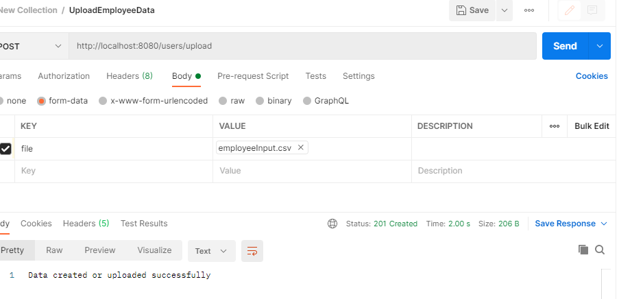
   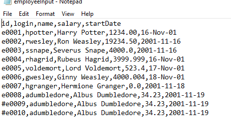
   
2. With duplicate data
   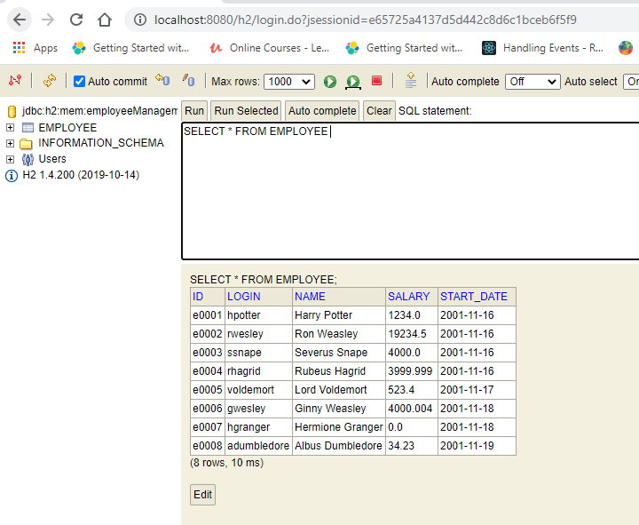
   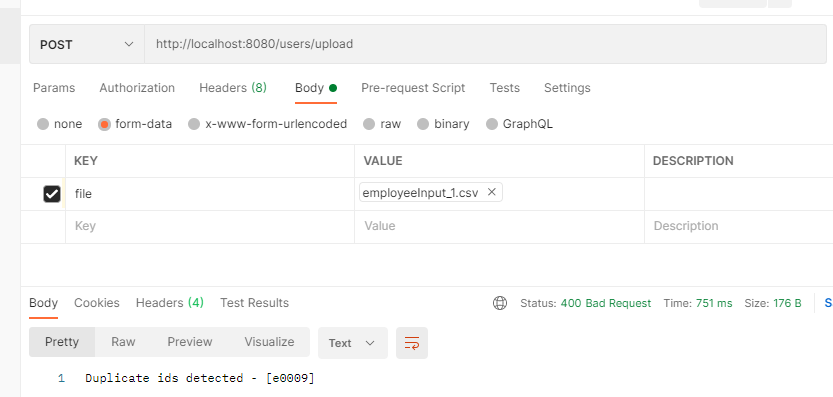
   
3. When login id is not unique
   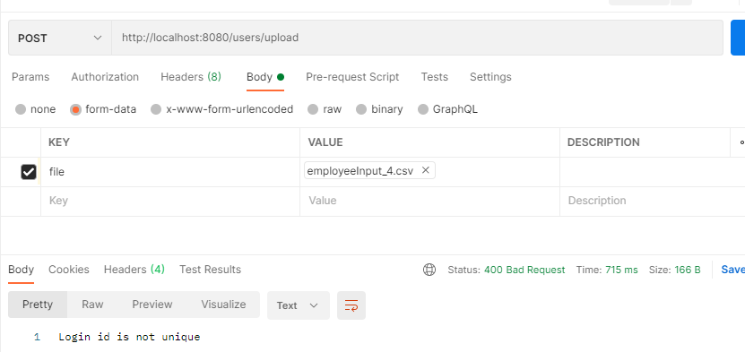
   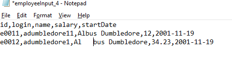

4. When input has commented lines
   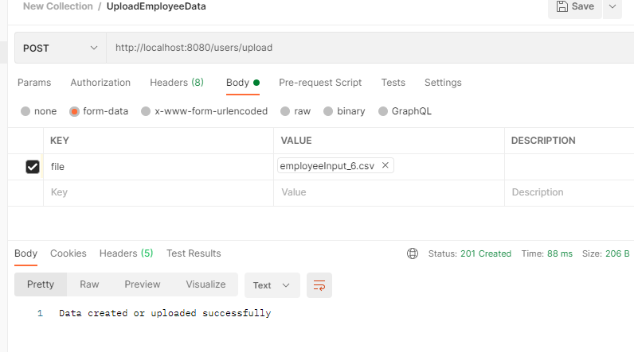
   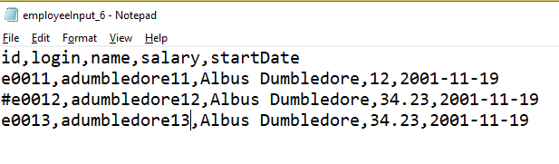
   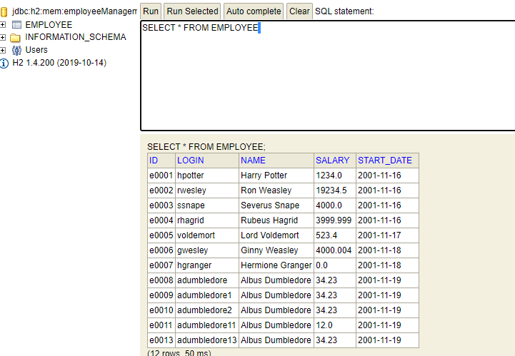
   
5. When input has non english characters
   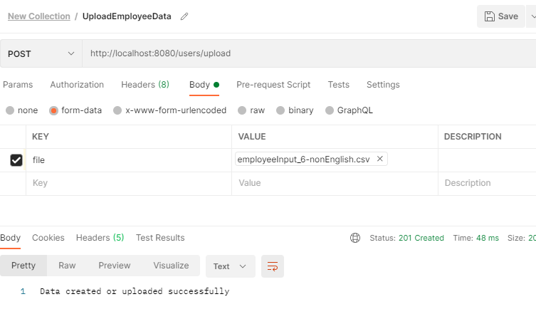
   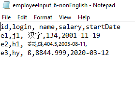
   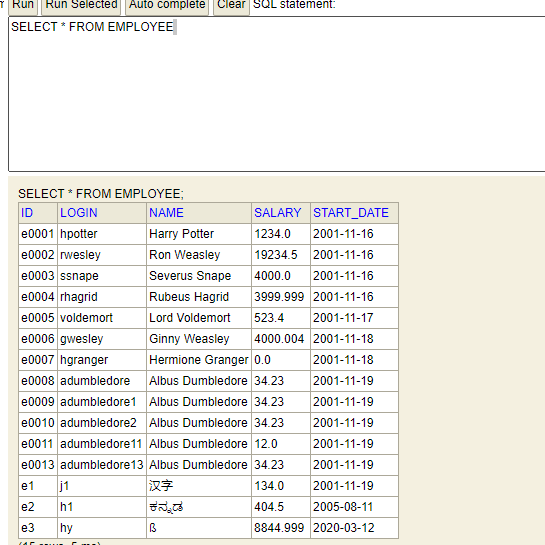

## /users
1. Specification is as present in the 'USER STORY 2: Fetch List of Employees' of the contract document
2. Additional sorting parameters can be specified in the following format separated by ","
    <fieldName1>-<orderOfSorting1>,<fieldName2>-<orderOfSorting2>
   Ex: salary-asc,startDate-desc
3. If fields provided for sorting is not present in the entity bad input error is thrown 
4. If the sort order is not specified or specified incorrectly, then ascending order is taken as default

###Results
1. When no params specified
   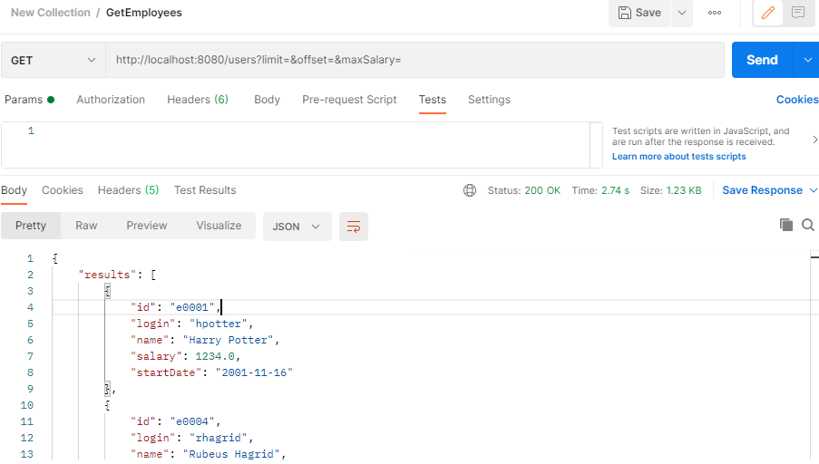
   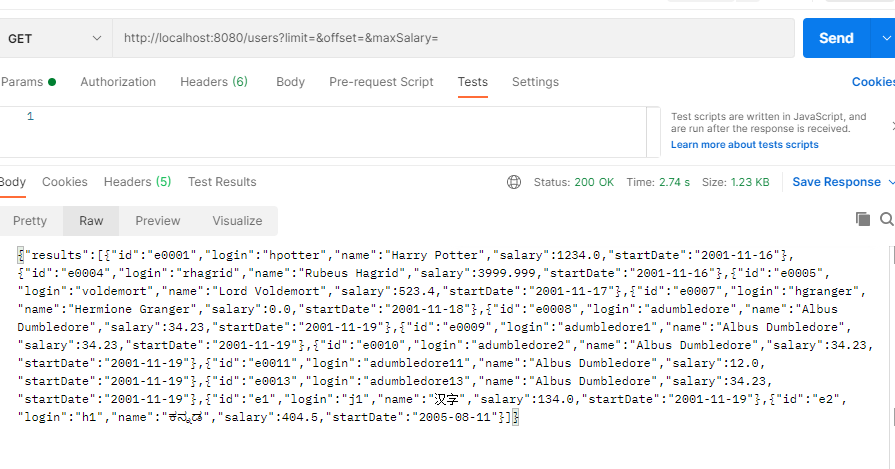
2. With maxSalary and minSalary 
   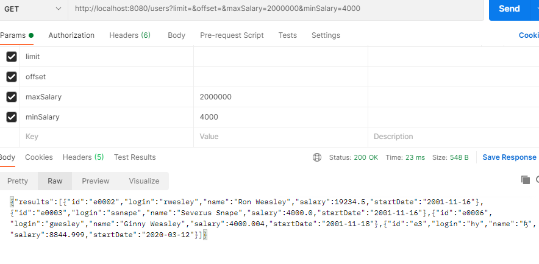
3. With limit and offset
   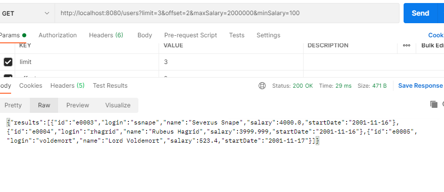
4. With sortParams
   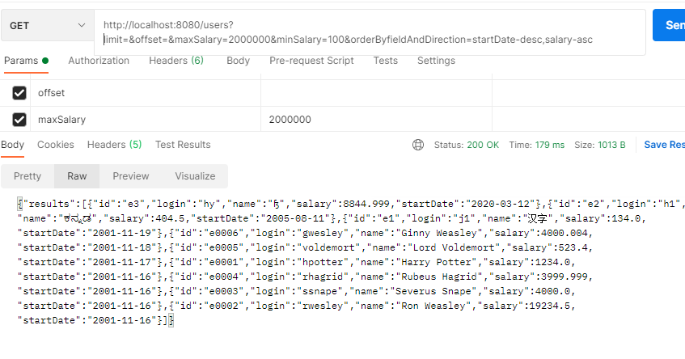

## CRUD APIs
1. Specification is as present in the 'USER STORY 3: CRUD'
2. Assumptions: Implemented PUT service for Update functionality as I assumed that there is a choice between PUT and PATCH
3. Any additional Json properties provided in the input apart from what is required for the entity will be ignored

###Results
1. create an Employee
   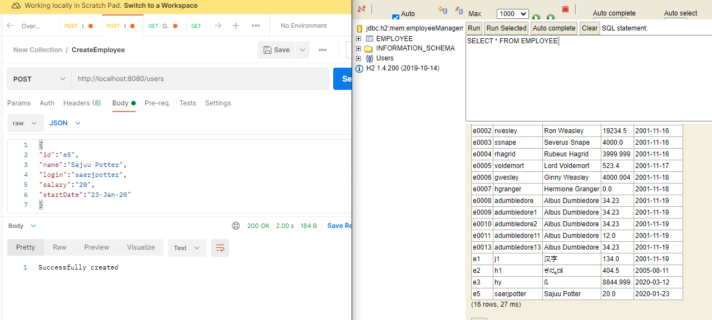
2. Update an Employee
   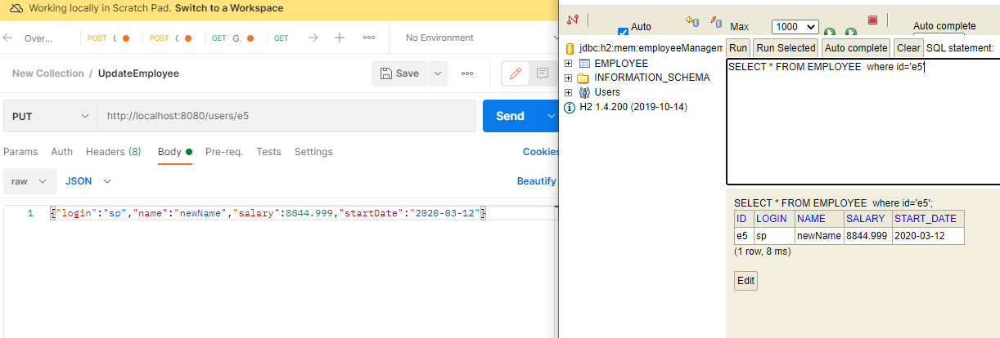
3. Get Employee by id
   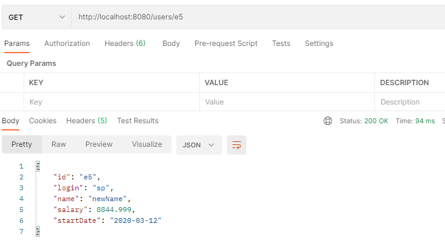
4. Delete Employee by id
   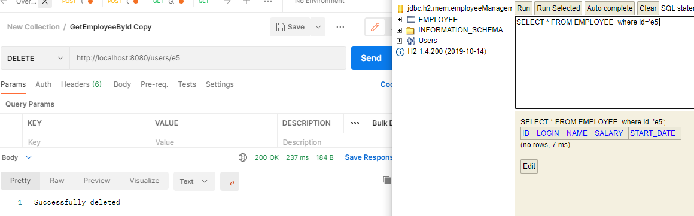